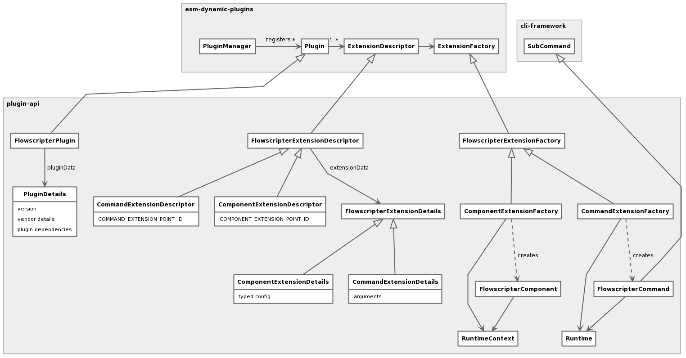

# plugin-api
[](https://github.com/flowscripter/plugin-api/blob/master/LICENSE)
[](https://david-dm.org/flowscripter/plugin-api)
[](https://travis-ci.com/flowscripter/plugin-api)
[](https://www.npmjs.com/package/@flowscripter/plugin-api)

> Flowscripter Plugin API.

## Overview
This project provides a Plugin API for the Flowscripter system.

#### Plugin
The Plugin API is based on extensions to the interfaces provided in the
[@flowscripter/esm-dynamic-plugins](https://github.com/flowscripter/esm-dynamic-plugins)
and [@flowscripter/cli-framework](https://github.com/flowscripter/cli-framework) projects.

The extended interfaces declare stricter types which explicit define their use as a plugin mechanism for the Flowscripter
[CLI](https://github.com/flowscripter/cli) and [Runtime](https://github.com/flowscripter/runtime).

The following high level class diagram illustrates these relationships:



#### Command

#### Component

#### Runtime

#### Runtime Context

###### Session

###### Registry

###### Datastore

**This is a work in progress**

## Development

Firstly:

```
npm install
```

then:

Build: `npm run build`

Watch: `npm run watch`

Lint: `npm run lint`

Docs: `npm run docs`

## API

[API documentation](https://flowscripter.github.io/plugin-api)

## Further Details

Further details on project configuration files and Javascript version support can be found in
the [template for this project](https://github.com/flowscripter/ts-template/blob/master/README.md#overview).

## License

MIT © Flowscripter
